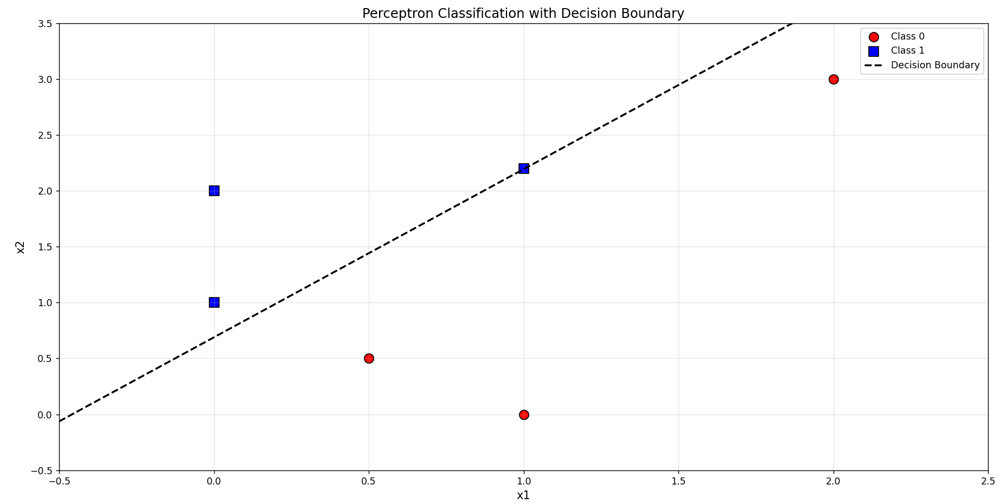

# Week 1 Exercises

## 1.1 - Perceptron

### 1.1.1

We updated the template to be the following:

```python
# Helper function to compute sigmoid
def sigmoid(x):
   return 1/(1 + np.exp(-x))

class SignActivation(ActivationFunction):
   """ 
         Sign activation: `f(x) = 1 if x > 0, 0 if x <= 0`
   """
   def forward(self, x):
      """
         This is the output function.
         TODO: Define the correct return function, given input `x`
      """
      if x > 0:
         return 1
      else:
         return 0
      
   def gradient(self, x):
      """
            Function derivative.
            Define the correct return value (derivative), given input `x`
      """
      return 0
   

class SigmoidActivation(ActivationFunction):
   def forward(self, x):
      return sigmoid(x)
   def gradient(self, x):
      return sigmoid(x) * (1 - sigmoid(x))


class LinearActivation(ActivationFunction):
   def forward(self, x):
      return x
   def gradient(self, x):
      return 1
```


We then tested using these values

```python
a = SignActivation()
print("Sign Activation")
print(a.forward(2))
print(a.forward(0))

b = SigmoidActivation()
print("")
print("Sigmoid Activation")
print(b.forward(2))
print(b.forward(0))

c = LinearActivation()
print("")
print("Linear Activation")
print(c.forward(2))
print(c.forward(0))

```

The output was this

```
Sign Activation
1
0

Sigmoid Activation
0.8807970779778823
0.5

Linear Activation
2
0
```

### 1.1.2 
We added for this task this code in the initialization of the perceptron: 
```python
# weights
mean = 0
std = 1
size = n_inputs + 1
self.w = np.random.normal(mean, std, size)
# activation function
 self.f = act_f()
```

To test this code we use this:
```python
## TODO Test perceptron initialization
p = Perceptron(2,LinearActivation)
print("")
print("Initial Weights")
print(p.w)
```

The output of this test is:
```bash
Initial Weights
[-0.52604498  0.78864828  1.59846333]
```
### 1.1.3
Here is the code:
```
   def activation(self, x):
      """
         It computes the activation `a` given an input `x`
         TODO: Fill in the function to provide the correct output
         NB: Remember the bias
      """
      a = np.sum(np.dot(self.w[1:], x)) + self.w[0]
      return a

   def output(self, a):
      """
         It computes the neuron output `y`, given the activation `a`
         TODO: Fill in the function to provide the correct output
      """
      y = self.f.forward(a)
      return y

   def predict(self, x):
      """
         It computes the neuron output `y`, given the input `x`
         TODO: Fill in the function to provide the correct output
      """
      a = self.activation(x)
      y = self.output(a)
      if y < 0:
         return 0
      else:
         return 1
```

### 1.1.4

We tested with different weights and rates, but we found a learning rate of 0.001, max epochs of 10_000, weight initialization mean of 0 and std of 1. The bias update and the input weights were updated seperately. The total error was combined and if it was below a threshold of 0.01 then the learning was stopped. With a learning rate of 0.001 we often got epochs over 1000, but every run was different.

```python
r = 0.001 # learning rate
for epoch in range(10_000):
   # print("Epoch: ", epoch)
   errors = np.zeros(len(xdata))
   for i in range(len(xdata)):
      t = ydata[i]
      y = p.predict(xdata[i,:])
      errors[i] = t - y
      
      # Fixed weight update: update bias and input weights separately
      p.w[0] = p.w[0] + r * errors[i]  # bias update
      p.w[1:] = p.w[1:] + r * errors[i] * xdata[i,:]  # input weights update
   error_sum = np.sum(np.abs(errors))
   if error_sum < 0.01:
      break
   # print(" - Error: ", error_sum)

# calculate the error and update the weights
print("Final weights:", p.w)
```

### 1.1.5
The final weight results depend on the initial values because there are infinite ways to place the decision boundary. The result is therefore depending from where the line is starting at, which is defined in the initialization.

The final weight values are:
```bash
Final weights: [-0.30640327 -0.66884034  0.44420975]
```

### 1.1.6
Here is the code for the plot:
```
plt.figure(figsize=(10, 8))

# Separate data points by class
class_0 = xdata[ydata == 0]
class_1 = xdata[ydata == 1]

# Plot data points with different colors
plt.scatter(class_0[:, 0], class_0[:, 1], c='red', marker='o', s=100, label='Class 0', edgecolors='black')
plt.scatter(class_1[:, 0], class_1[:, 1], c='blue', marker='s', s=100, label='Class 1', edgecolors='black')

# Create decision boundary line
# The decision boundary is where w0 + w1*x1 + w2*x2 = 0
# Solving for x2: x2 = (-w0 - w1*x1) / w2
w0, w1, w2 = p.w[0], p.w[1], p.w[2]

# Define x1 range for the line
x1_range = np.linspace(-0.5, 2.5, 100)

if w2 != 0:  # Avoid division by zero
      x2_boundary = (-w0 - w1 * x1_range) / w2
      plt.plot(x1_range, x2_boundary, 'k--', linewidth=2, label='Decision Boundary')

# Add labels and formatting
plt.xlabel('x1', fontsize=12)
plt.ylabel('x2', fontsize=12)
plt.title('Perceptron Classification with Decision Boundary', fontsize=14)
plt.legend()
plt.grid(True, alpha=0.3)

# Set axis limits to show all points clearly
plt.xlim(-0.5, 2.5)
plt.ylim(-0.5, 3.5)

plt.tight_layout()
plt.show()
```
Here is an image of the plot:


## 1.2