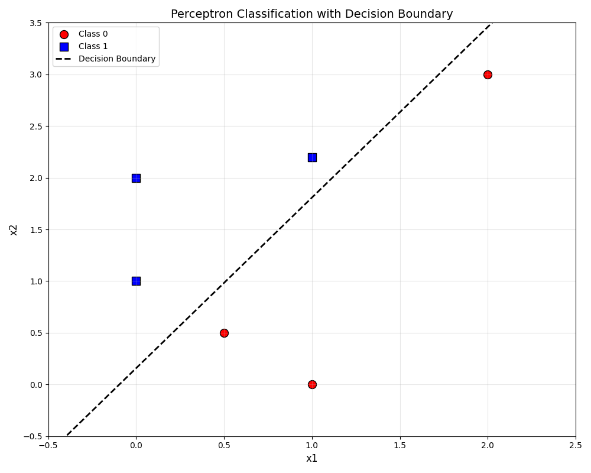

# Week 1 Exercises

## 1.1 - Perceptron

### 1.1.1

We updated the template to be the following:

```python
# Helper function to compute sigmoid
def sigmoid(x):
   return 1/(1 + np.exp(-x))

class SignActivation(ActivationFunction):
   """ 
         Sign activation: `f(x) = 1 if x > 0, 0 if x <= 0`
   """
   def forward(self, x):
      """
         This is the output function.
         TODO: Define the correct return function, given input `x`
      """
      if x > 0:
         return 1
      else:
         return 0
      
   def gradient(self, x):
      """
            Function derivative.
            Define the correct return value (derivative), given input `x`
      """
      return 0
   

class SigmoidActivation(ActivationFunction):
   def forward(self, x):
      return sigmoid(x)
   def gradient(self, x):
      return sigmoid(x) * (1 - sigmoid(x))


class LinearActivation(ActivationFunction):
   def forward(self, x):
      return x
   def gradient(self, x):
      return 1
```


We then tested using these values

```python
a = SignActivation()
print("Sign Activation")
print(a.forward(2))
print(a.forward(0))

b = SigmoidActivation()
print("")
print("Sigmoid Activation")
print(b.forward(2))
print(b.forward(0))

c = LinearActivation()
print("")
print("Linear Activation")
print(c.forward(2))
print(c.forward(0))

```

The output was this

```
Sign Activation
1
0

Sigmoid Activation
0.8807970779778823
0.5

Linear Activation
2
0
```

### 1.1.2 
We added for this task this code in the initialization of the perceptron: 
```python
# weights
mean = 0
std = 1
size = n_inputs + 1
self.w = np.random.normal(mean, std, size)
# activation function
self.f = act_f()
```

To test this code we use this:
```python
## TODO Test perceptron initialization
p = Perceptron(2,SigmoidActivation)
print("")
print("Initial Weights")
print(p.w)
```

The output of this test is:
```bash
Initial Weights
[-0.52604498  0.78864828  1.59846333]
```
### 1.1.3
Here is the code:
```python
   def activation(self, x):
      """
         It computes the activation `a` given an input `x`
         TODO: Fill in the function to provide the correct output
         NB: Remember the bias
      """
      a = np.sum(np.dot(self.w[1:], x)) + self.w[0]
      return a

   def output(self, a):
      """
         It computes the neuron output `y`, given the activation `a`
         TODO: Fill in the function to provide the correct output
      """
      y = self.f.forward(a)
      return y

   def predict(self, x):
      """
         It computes the neuron output `y`, given the input `x`
         TODO: Fill in the function to provide the correct output
      """
      a = self.activation(x)
      y = self.output(a)
      return y
```

### 1.1.4

We tested with different weights and rates, but we found a learning rate of 0.1, max epochs of 10_000, weight initialization mean of 0 and std of 1. The bias update and the input weights were updated seperately. The total error was combined and if it was below a threshold of 0.1 then the learning was stopped. With a learning rate of 0.1 we often got epochs over 1000, but every run was different.

```python
r = 0.1 # learning rate
   for epoch in range(10_000):
      print("Epoch: ", epoch)
      errors = np.zeros(len(xdata))
      for i in range(len(xdata)):
         t = ydata[i]
         y = p.predict(xdata[i,:])
         errors[i] = t - y
         
         # Fixed weight update: update bias and input weights separately
         p.w[0] = p.w[0] + r * errors[i]  # bias update
         p.w[1:] = p.w[1:] + r * errors[i] * xdata[i,:]  # input weights update
      error_sum = np.sum(np.abs(errors))
      if error_sum < 0.1:
         break
      print(" - Error: ", error_sum)

   # calculate the error and update the weights
   print("Final weights:", p.w)
```

### 1.1.5
The final weights are roughly the same in each run (when using SigmoidActivation), because they are converging on an optimal decision boundary that is between the two classes. The StepActivation has larger differences between runs, because it stops learning as soon as all points are classified correctly, the points are therefore also closer to the decision boundary. The initial values have a larger say using this activation function. 

The final weight values are for the sigmoid activation function:
```bash
Final weights: [ -1.22747163 -12.77125736   7.73938036]
```

### 1.1.6

Here is an image of the plot. We can see that the decision boundary line seperates the 2 classes perfectly, and that the nearest points of each class are rougly equidistance from the line. This is caused by us using the Sigmoid Activation function. 




## 1.2 - Multi-Layer Perceptron 

### 1.2.1

We copied the TODO_perceptron.py and then imported the activation functions into the TODO_mlp.py, so we didn't have to copy code one more time.

### 1.2.2

This is the code

```python
class Layer:
   def __init__(self, num_inputs, num_units, act_f):
      """ 
         Initialize the layer, creating `num_units` perceptrons with `num_inputs` each. 
      """
      # TODO Create the perceptrons required for the layer
      self.ps = []
      self.num_units = num_units
      for _ in range(num_units):
         p = Perceptron(num_inputs, act_f)
         self.ps.append(p)

# TODO: Test Layer class init
x_test = np.array([[np.pi, 1]]).T
l = Layer(2, 5, LinearActivation)
print("\nLayer Test")
print(l.predict(x_test))
for p in l.ps:
   print(p.w)
```

The outcome was the following. It worked.

```bash
Layer Test
[ 6.56900882  7.31165826  7.71215255  0.33625482 -8.18980561]
[0.85248635 1.50955608 0.97411219]
[1.02770851 1.96748619 0.10290959]
[0.39165211 2.05807135 0.85487861]
[-1.40966651  0.44780008  0.33911588]
[-0.91159918 -2.13877061 -0.55906039]
```

### 1.2.3
The output layer will have 3 inputs.


### 1.2.4
In the class MLP, we implemented the function predict like this:
```python
   def predict(self, x):
      """ 
      Forward pass prediction given the input x
      TODO: Write the function
      """
      y_l1 = self.l1.predict(x)
      y_l_out = self.l_out.predict(y_l1)
      return y_l_out
```

To test it we let this getting printed in the terminal:
```python
   # TODO: Test MLP class init
   mlp = MLP(2, 5, 1)
   print("\nMLP Test")
   print(" - L1 shape: ", mlp.l1.w.shape)
   print(" - Lout shape: ", mlp.l_out.w.shape)
   print(" - Test predict: ", mlp.predict(x_test))
```

The output is:
```
MLP Test
 - L1 shape:  (3, 5)
 - Lout shape:  (6, 1)
 - Test predict:  [2.93695411]
```
So the hidden layer has 3 inputs (2 data inputs and 1 bias) and 5 units. The output layer then has 5 in
and one output, which is the overall predict.

### 1.2.5

The code is here

```python
def calc_prediction_error(model, x, t):
   """ Calculate the average prediction error """
   # TODO Write the function
   n = len(t)
   error = np.zeros(n)

   for i in range(n):
      y = model.predict(x[i])
      error[i] = np.abs(y[0] - t[i])**2

   return np.sum(error) / n
   
# Test calc_prediction_error
x_test = np.random.rand(10,2)
t_test = np.random.rand(10)
print(x_test)
print(t_test)
print(calc_prediction_error(mlp, x_test, t_test))
```

This is the outcome

```bash
x_test: 
[[0.71915088 0.10388935]
 [0.06641103 0.57469974]
 [0.12172227 0.03804077]
 [0.26212305 0.39714192]
 [0.48837771 0.31950406]
 [0.05101796 0.28989955]
 [0.38618352 0.87166654]
 [0.66083862 0.6422711 ]
 [0.271169   0.15029427]
 [0.12607583 0.71767084]]
 
[0.95056408 0.88838198 0.16659071 0.55860474 0.24495209 0.81492149
 0.41569337 0.10078243 0.00596202 0.39430957]
 
MSE: 1.5858207137898916
```


### 1.2.6
We implemented the training loop in the following way:

`````
   def train(self, inputs, outputs):
      """
         Train the network

      Parameters
      ----------
      `x` : numpy array
         Inputs (size: n_examples, n_inputs)
      `t` : numpy array
         Targets (size: n_examples, n_outputs)

      """
      n = len(inputs)

      # Initialize accumulators
      dw1 = np.zeros_like(self.l1.w)
      dw3 = np.zeros_like(self.l_out.w)
      # Loop over training examples
      
      for i in range(n):
         x = inputs[i]
         t = outputs[i]

         # Forward pass
         a1 = self.l1.activation(x)
         o1 = self.l1.output(a1)
         a3 = self.l_out.activation(o1)
         y = self.l_out.output(a3)

         # Backpropagation
         delta_out = self.l_out.gradient(a3) * (y - t)
         delta1 = self.l1.gradient(a1) * np.dot(self.l_out.w[1:], delta_out)

         # Add weight change contributions to temporary array
         o0 = np.insert(x, 0, 1)
         o1 = np.insert(o1, 0, 1)

         dw1 += delta1.reshape(-1,1).dot(o0.reshape(1,-1)).T
         dw3 += delta_out.reshape(-1,1).dot(o1.reshape(1,-1)).T

      # Update weights
      self.l1.update_weights(-self.alpha * dw1 / n)
      self.l_out.update_weights(-self.alpha * dw3 / n)

   This performs the forward pass, saving intermediate steps. Calculates the weight change, and calculates the error, updating weights in the end.

### 1.2.7
we trained the network using the following code, utilizing 4 examples and 2 hidden units. 
   # XOR input and target data
   X = np.array([
      [0, 0],
      [0, 1],
      [1, 0],
      [1, 1]
   ])

   T = np.array([0, 1, 1, 0])

   # Initialize MLP with 2 hidden units and 1 output
   mlp = MLP(num_inputs=2, n_hidden_units=2, n_outputs=1, alpha=0.5)

   # Training loop
   epochs = 2000
   mse_list = []

   for epoch in range(epochs):
      mlp.train(X, T)
      err = calc_prediction_error(mlp, X, T)
      mse_list.append(err)

      if epoch % 200 == 0 or epoch == epochs - 1:
         print(f"Epoch {epoch}: MSE = {err:.6f}")

   # Final predictions after training
   print("\nFinal predictions after training:")
   for x, t in zip(X, T):
      y = mlp.predict(x)
      print(f"Input: {x}, Target: {t}, Prediction: {y[0]:.4f}")


We tested for learning rates 0.001, 0.01, 0.5 and 0.1. 


we see it converges at around 1200 epochs for lr=0.001, but already at around 200 epochs for both 0.01 and 0.1.

## 1.3 Fable exercise
\underline{For the first question}; What happens if you change the relative position of the camera and the robot after starting your code?

If we were to change these positions the code wouldn't be purposeful. The robot would no longer move to the intented position. It will be missed alined with the intented training position and would therefore produce incorrect output.

\underline{For the second question}; In your solution, is learning active all the time.

The answer is no.

\underline{For the last question}; If not, could you imagine a way to change your solution to have "active" (online) learning? Would it work?

We didn't implement online learning but if we were to implement it we would keep the angles while testing/running the code. We would then retrain the model after a certain amount of time e.g. after 10 clicks. 

## 1.4 Spiking Neuron Model
