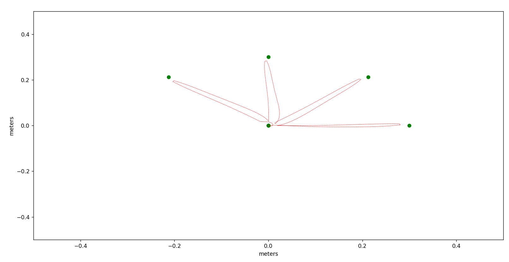
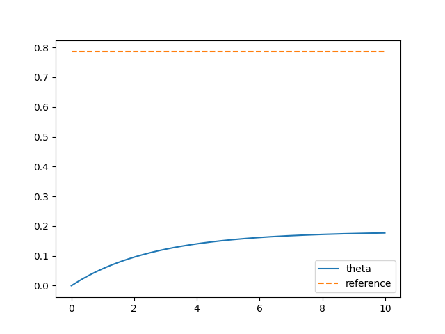
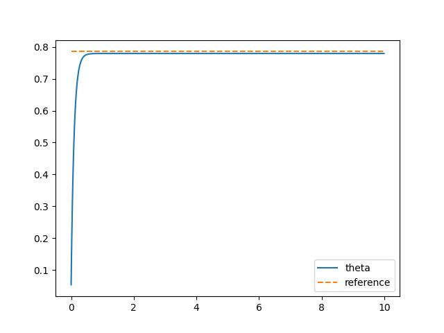
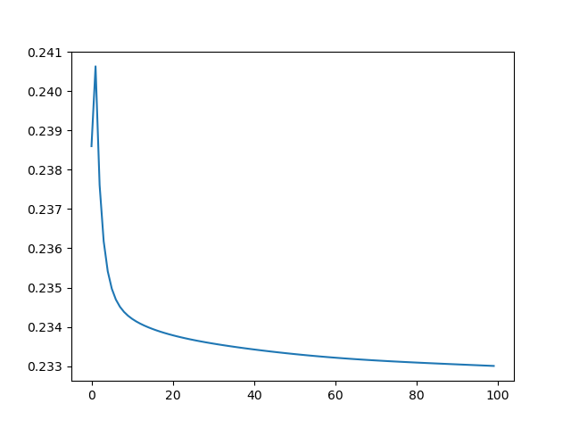
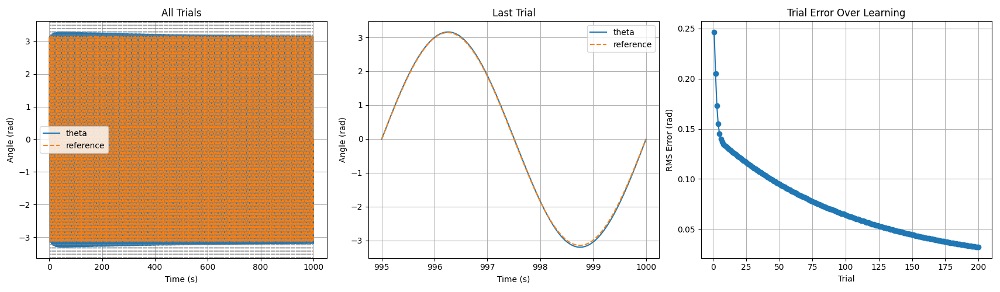
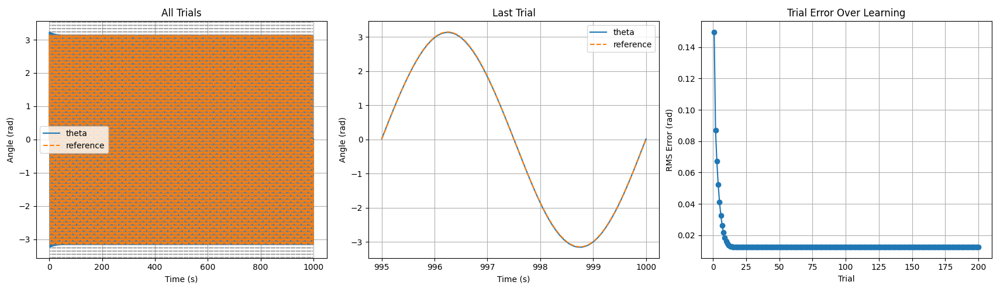

# Week 2 Exercises

## 2.1 - Feedback controller with plant delay

### 2.1.1

This is the code

```python
delay = [0,1,2,3]

Python
## Simulation
for t in range(simlen-1):
    for d in delay:
        # Compute output
        # TODO include the time delay

        if t - d < 0:
            u = K[1] * (target - y[0, d])
        else:
            u = K[1] * (target - y[t - d, d])
        y[t+1, d]=0.5*y[t,d] + 0.4*u # 1st order dynamics

## Plot
time = range(simlen)
for d in delay:
    plt.plot(time, y[:, d], label=f'delay {d}')
plt.xlabel('time step')
plt.ylabel('y')
plt.show()
```

The feedback control performs worse the greater the delay gets. The over
hoot is bigger and the settling time is longer.


### 2.1.2

This test was done using a delay of 1 and varying K's (0.25, 0.5, 1.5, 3). When using 3, the system is unstable. 0.25 and 0.5 have no oscillations at all, but the speed of convergence is faster for 0.5. 1.5 has more oscillations but is not as unstable as 3.


## 2.2 - Target reaching with delay

### 2.2.1
We compute noise, and add it to the desired torque that we apply to the plant. This is achieved with the following code:

```python
#noise
noise_coeff = 0.1
noise = np.random.randn(*desired_torque.shape) * noise_coeff * np.abs(desired_torque)
desired_torque_noisy = desired_torque + noise
ang, vel, acc = Sim.plant(ang, vel, acc, desired_torque_noisy)
```

We varied the noise coefficient to see the impact. 
This is the path with 0.0 noise coefficient:


This is the path with 0.1 noise coefficient:


This is the path with 0.5 noise coefficient:


This is thh path with 1.0 noise coefficient:


As we can see, the positions are reached with the noise coefficients of 0.0 and 0.1, however for greater noise such as the two latter values, the path becomes more erratic, and the goals aren't reached for all 4 positions. When inspecting the velocity/acceleration/jerk curves for the paths with larger noise, it can also be seen that it doesn't stabilize nearly as quickly. These plots are omitted for brevity. 

### 2.2.2

The bigger the delay, the bigger the oscillations become, and when the delay is bigger than 15ms the system is unstable. A delay of 5ms was reasonable as seen in the plot.

 
## 2.2.3
The system can cope when the proportional (gain) parameter is lowered and the derivative (damping) parameter is raised. When keeping the delay and proportional parameter stable then the derivative parameter is very sensitive when lowered. And when keeping the derivative parameter stable and then raising the gain the proportional parameter is not as unstable as the derivative parameter was.

Normal plot (kp = 200 and kd = 11.0)


kp = 300 (kd = 11.0)


kp = 100 (kd = 11.0)


kd = 2.0 (kp = 200)


kd = 20.0 (kp = 200)


## 2.3 - Feedback and feedforward control

### 2.3.1
The following plots show the effects of different delays. The system overshoots and takes longer to stabilize when the delay increases and only feedback control is enabled.

**0.025:**


**0.07:**


**0.1:**


### 2.3.2

When faced with a disturbance and the forward model turned off, the error increases while the disturbance is enabled, and it stabilizes 0.3s after the disturbance ends.


### 2.3.3

Because the system just consists of the forward part, so the delay does not affect the system.


### 2.3.4

Here the model doesn't recognize the disturbance, so it doesn't settle back the target angle.


## 2.4 - Smith predictor with learned model

### 2.4.1

With an alpha of 1e-4, the last trial error is minimal.


An alpha of 1e-5 is tool low for the given number of trials. There is still a noticeable error on the last trial


An alpha of 1e-3 is too high, it encounters a runtime overflow error, and doesn't converge.


### 2.4.2

Here, we plotted the weights over the learning trials. As we can see, the weights converge. 


### 2.4.3
When the delay is not precisely known, the error in general remains quite big. It can be noticed, that if the delay is estimated shorter, that it actually is, that the training improves the performance. But if the delay is estimated longer, the training makes the error even worse.

For a estimated delay of 9 time steps:


For a estimated delay of 11 time steps:


## 2.5 - Introduction to CMAC

Keeping N=5, and increasing sigma to 2.0, results in a good model.

This is the receptive field plot, showing relatively large overlap between fields


This is the output, showing low error. The epochs was increased to 2000 since 100 was not high enough for the learning to converge.


The MSE shows learning has converged


With higher n_examples, less epochs are needed for the learning to converge. However the MSE remains roughly the same. To test if the order of the examples mattered, we randomized x, and it had no effect on the output.


## 2.6 - Control with CMAC

### 2.6.1
The code with just the PD controller with the original values leads to this output.



### 2.6.2
After changing the values of the PD controller to:

```python
## Feedback controller variables
Kp = 150
Kv = 10
```


### 2.6.3
For the new sinus trajectory, we changed this in the code:

In the initialization:
```python
## TODO: Define parameters for periodic reference trajectory
A = np.pi
T = 5
```
In the loop:
```python
## TODO: Calculate the reference at this time step
# theta_ref = np.pi/4
theta_ref = A*np.sin(2*np.pi/T*t)
```
The new trajectory is now looking like that for 5 trials:


### 2.6.4
The CMAC is initialized like this in the code:

```python
## TODO: CMAC initialization
n_rfs = 11
min = [-np.pi, -np.pi] 
max = [np.pi, np.pi] 
beta = 1e-1

c = CMAC(n_rfs=n_rfs, xmin=min, xmax=max, beta=beta)
```

In the loop the CMAC is then used for the control and learns through the trials.

```python
## TODO: Implement the CMAC controller into the loop
tau_cmac = c.predict([theta_ref, theta])
c.learn(tau_m)
    
tau = tau_m + tau_cmac
```

### 2.6.5
For a learning rate of 1e-1 the average trial error is declining like shown in the plot. After around 60 to 80 trials the error is just declining minimally.



### 2.6.6
We ran the model for two higher frequencies and one lower. We see that the model handles the lower frequency well, but struggles with the higher frequencies. 


### 2.6.7
It would definetely be possible to include a 3rd input variable. The code would need to be expanded as it is coded for input size 2, but theoretically it isn't an issue to include more. The amount of receptive fields could be increased as well, to lessen overlap from introducing more variables. 

## 2.7 - Adaptive filter controller

We copied the simulation loop from exercise 6

### 2.7.3

Below are 3 different test with different number of bases. The number of bases doesn't seem to affect the accuracy, but the convergence time is quicker with more bases

2 Bases:


5 Bases:


10 Bases:



### 2.7.4

### 2.7.5